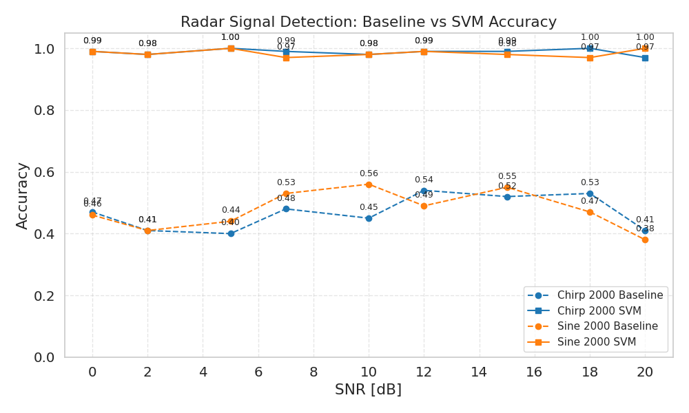

# Radar Signal Detection & Classification under Noise

[](https://www.python.org/downloads/)
[](#)
[](#)
[](https://scikit-learn.org/)
[](https://opensource.org/licenses/MIT)

End-to-end radar signal processing and classical machine learning for target detection in noisy environments


## Context

This project simulates a simplified radar system for detecting and classifying targets in noisy signals.  
The goal is to build a complete pipeline: **signal simulation → feature extraction → classification → robustness analysis**

The project avoids:
- complex 3D tracking
- heavy deep learning
- excessive or unrealistic optimizations

---

## Repository Structure

```text
radar-signal-detection/
├── config/
│   └── config.yaml
├── data/
├── data_generation/
│   └── simulate_signals.py
├── signal_processing/
│   └── fft_analysis.py
├── features/
│   └── extract_features.py
├── models/
│   └── classifier.py
├── evaluation/
│   └── robustness_analysis.py
├── main.py
└── README.md

```


- Every code folder contains `__init__.py` to make it a valid Python package.  
- The pipeline is modular and readable; each step can be tested individually.

---

## Installation

1. Clone the repository:

```
git clone https://github.com/leonardomagaraggia/Radar-Signal-Detection
cd radar-signal-detection
```

2. Create a virtual environment (Python >= 3.9):

```
python -m venv venv
source venv/bin/activate    # macOS/Linux
venv\Scripts\activate       # Windows
```

3. Install dependencies:

```
pip install -r requirements.txt
```

> The requirements.txt contains:
> 
> - numpy>=1.24,<2.0  
> - scipy>=1.10,<2.0  
> - pyyaml>=6.0,<7.0  
> - scikit-learn>=1.3,<2.0  

---

## Configuration (`config/config.yaml`)

Key parameters:

- **Simulation**
  - `fs`: sampling frequency (Hz)
  - `duration`: signal duration (s)
  - `waveform`: `"chirp"` or `"sine"`
  - `f0`, `f1`: initial/final frequencies for chirp
  - `amplitude`: signal amplitude

- **Dataset**
  - `n_signals`: total number of signals
  - `min_targets` / `max_targets`: number of targets per example

- **Targets**
  - `doppler_range`: Doppler interval (Hz)
  - `amplitude_range`: target amplitude range

- **Noise**
  - `snr_db_list`: list of SNR levels to generate

- **Output**
  - `out_dir`: output folder
  - `filename`: dataset filename

- `seed`: for reproducibility

---

## Usage / Run

Generate dataset and run the pipeline:

```
python main.py
python -m evaluation.robustness_analysis
```

- `main.py` generates signals according to `config.yaml`  
- `robustness_analysis.py` calculates Baseline and SVM accuracy for each SNR  

**Note**: make sure to run from the project root or set `PYTHONPATH`:

```
export PYTHONPATH=$(pwd)       # macOS/Linux
$env:PYTHONPATH="$PWD"          # Windows PowerShell
```

---

## Pipeline Overview

1. **Signal Generation**  
   - Chirp or sinusoidal signals
   - Multiple targets with random Doppler
   - AWGN + random jitter noise

2. **Signal Processing**
   - Single-sided FFT
   - Feature extraction: dominant frequency, energy, bandwidth

3. **Classification**
   - Threshold-based baseline on energy
   - Linear SVM on extracted features

4. **Evaluation**
   - Accuracy vs SNR
   - Baseline vs SVM comparison

---

## Sample Results

| Configuration | SNR [dB] | Baseline | SVM |
|---------------|-----------|----------|-----|
| Chirp 2000 signals | 0 | 0.47 | 0.99 |
| " | 5 | 0.40 | 1.00 |
| " | 10 | 0.45 | 0.98 |
| Sine 2000 signals | 0 | 0.46 | 0.99 |
| " | 5 | 0.44 | 1.00 |
| " | 10 | 0.56 | 0.98 |

---

## Visualization

The project includes an elegant comparative plot for Baseline vs SVM for Chirp and Sine waveforms (2000 signals):

## Detection Accuracy vs SNR



*Figure 1 — Detection accuracy comparison between a simple energy-based baseline and a linear SVM classifier under different SNR conditions.*

---

## Considerations

- **Baseline** degrades at low SNR, consistent with random noise and jitter.  
- **SVM** maintains high performance even at low SNR, showing that the designed features effectively separate target from no-target signals.  
- The waveform difference (`chirp` vs `sine`) is noticeable but not critical: the model leverages energy and bandwidth more than waveform shape.  
- Larger datasets or more targets increase robustness and result variation.

---

## Limitations

- Synthetic dataset: the SVM's near-perfect results are partially due to artificially separable signals.  
- Not real-time, no 3D tracking included.  
- Baseline is intentionally simple for comparison; more complex models are not included.

---

## Future Work

- Extend to realistic dataset with multiple reflections and radar clutter.  
- Add signals with closer Doppler values to increase difficulty.  
- Explore additional features: skewness, kurtosis, peak ratios.  
- Interactive comparative plots for faster analysis.

---

## License

Distributed under the **MIT License**. See the `LICENSE` file for more information.

---

**Developed by:** Leonardo Magaraggia
**GitHub:** [@leonardomagaraggia](https://github.com/leonardomagaraggia)
